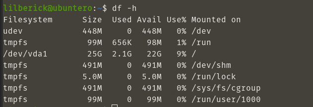

# [UpCloud](https://upcloud.com/)


## Levantar servidor ubuntu
1. definimos credenciales como variables de entorno agregando al final. Usuario y password de cuenta de UpCloud
	```
	$ vim .zshrc
	```
	```bash
	export UPCLOUD_USERNAME="Username for Upcloud API user"
	export UPCLOUD_PASSWORD="Password for Upcloud API user"
	```
2. Inicio
	```
	$ vim version.tf
	```

	```bash
	terraform {
	  required_providers {
	    upcloud = {
	      source = "UpCloudLtd/upcloud"
	      version = "~>2.0.0"
	    }
	  }
	}

	provider "upcloud" {
	  # Your UpCloud credentials are read from the environment variables
	  # export UPCLOUD_USERNAME="Username for Upcloud API user"
	  # export UPCLOUD_PASSWORD="Password for Upcloud API user"
	  # Optional configuration settings can be depclared here
	}
	```
	```
	$ terraform init
	```

	

3. Planificando la infraestructura
	1. Definimos el servidor
		```
		$ vim server1.tf
		```
		```bash
		resource "upcloud_server" "servidor1" {
		  hostname = "ubuntero"
		  zone = "us-nyc1"
		  plan = "1xCPU-1GB"
		  template {
		    # System storage device size
		    size = 25
		    # Template UUID for Ubuntu 20.04
		    storage = "01000000-0000-4000-8000-000030200200"
		  }
		  network_interface {
		    type = "public"
		  }
		network_interface {
		    type = "utility"
		  }
		  # Include at least one public SSH key
		  login {
		    user = "lilberick"
		    # $ cat ~/.ssh/id_rsa.pub
		    keys = [
			"ssh-rsa AAAABBBBBBBBBBBBBBBBBBBBBBBBBBBBBBBBBBBBBBBBB lilberick@debian"
		    ]
		    create_password = true
		    password_delivery = "email"
		  }
		  connection {
		    # The server public IP address
		    host        = self.network_interface[0].ip_address
		    type        = "ssh"
		    user        = "lilberick"
		    private_key = file("~/.ssh/id_rsa")
		  }
		 # Remotely executing a command on the server
		  provisioner "remote-exec" {
		    inline = [
		      "echo 'Hello world!'"
		    ]
		  }
		}
		```
	2. Verificamos que todo este bien

		```
		$ terraform plan
		```

		
		

	3. Aplicamos y creamos el servidor
		```
		$ terraform apply
		```

		

	4. En nuestro correo gmail recibiremos la password registrado en la cuenta de UpCloud 

		

4. Verificamos que hemos creado el servidor en nuestra cuenta de UpCloud
	1. Ir a	: [UpCloud](https://hub.upcloud.com/)

		

5. Conexion por ssh

	```
	$ ssh lilberick@209.151.154.139
	```
	1. Vemos el espacio usado

		

	2. si queremos entrar como super usuario

		

6. Conexion por VNC
	1. Ir a	: [UpCloud](https://hub.upcloud.com/)
	2. Clic en nuestro servidor

		

	3. Clic en: **Console**

		

	4. Habilitamos

		

	5. Clic en: Save changes

		

	6. Abrimos VNC
		1. Ejecutamos el programa
		
			```
			$ ./VNC-Viewer-6.20.529-Linux-x64
			```

		2. Clic en: File/New connection
		3. Colocamos el VNC address y el VNC port: **`us-nyc1.vnc.upcloud.com:65414`**

			

		4. clic para iniciar la conexion

			

			

		5. Colocamos la password

			

		6. Colocamos usuario y password de usuario que creamos (password que llego a nuestro correo gmail)

			

			

			

		7. Para darle interfaz grafica

			```
			$ sudo apt update
			$ sudo apt upgrade
			$ sudo apt install lightdm
			```

			

			

			


